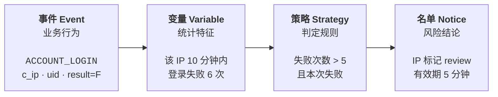
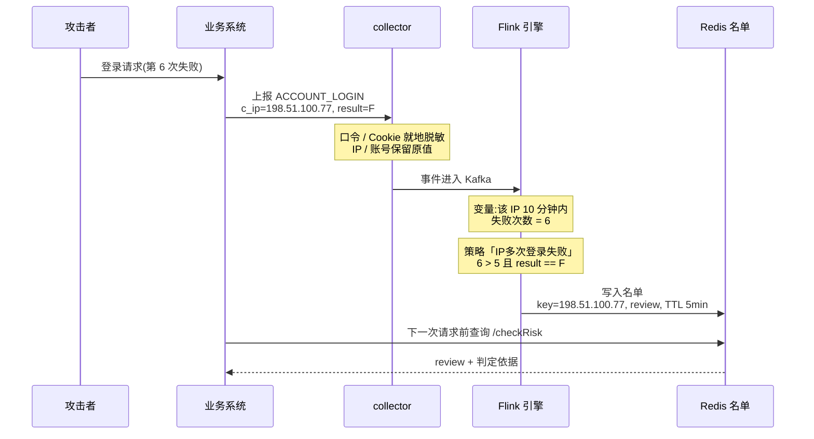
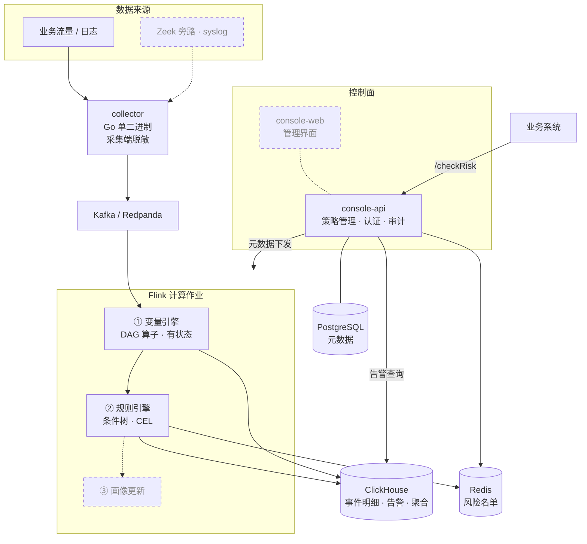
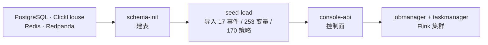

# 星云 Nebula 2.0

> **业务风控系统 · 开源版**
> 实时识别撞库、盗号、恶意注册、刷单、薅羊毛、爬虫等业务风险。

[](LICENSE)
[](https://github.com/threathunterX/nebula2/releases/latest)
[](https://github.com/threathunterX/nebula2/actions/workflows/ci.yml)
[](#项目状态)

---

## 这是什么

星云是一套**业务风控**系统 —— 重心不是「这个请求有没有 SQL 注入」,而是:

- 同一个 IP 在 10 分钟内登录失败 50 次 → 撞库
- 一个账号同时在 5 个城市登录 → 盗号
- 500 个新注册账号用了同一个设备指纹 → 批量注册
- 一批订单下单后从不支付 → 恶意占库存
- 活动开始 3 秒内被领走 80% 的券 → 薅羊毛

它通过**旁路采集**业务流量或日志,还原成标准化的业务事件,在事件流上做实时统计与
策略判定,产出风险名单和处置决策,再由业务系统消费。

整套系统围绕四层模型运转:



**一条告警是怎么产生的** —— 以撞库为例:



脱敏发生在**数据离开你的网络边界之前**,不是「先收上来再说」。实际效果:

```bash
echo '{"name":"ACCOUNT_LOGIN","timestamp":1784944800000,"c_ip":"198.51.100.1",
       "uid":"alice","password":"hunter2","cookie":"sid=abc123","result":"F"}' \
  | nebula-collector -events seeds/events
```

```json
{
  "name": "ACCOUNT_LOGIN",  "timestamp": 1784944800000,
  "c_ip": "198.51.100.1",   "uid": "alice",      ← 保留原值
  "password": "<REDACTED>", "cookie": "<REDACTED>",  ← 就地脱敏
  "result": "F"
}
```

口令和 Cookie 被抹掉,IP 和账号保留 —— 这不是疏漏。`c_ip` 一旦在采集端哈希,地理
定位、IP 信誉、跨维度关联就全部失效,风控直接废掉。所以分成两条界限:`sensitive`
在采集端就地脱敏(原文不出边界),`pii` 保持原值、由存储层加密保护。完整论证见
[隐私设计](docs/security/privacy.md)。

内置 17 类事件模型、253 个统计变量、170 条策略模板 —— 这些是从
[Nebula 1.x](https://github.com/threathunterX/nebula)(2019 年开源,1098 star)
继承并经过审计的风控知识沉淀。**技术栈完全重写,只继承领域资产,不继承代码。**

> 内置策略中也有 19 条基于特征匹配的 WAF 类规则(SQL 注入、XSS、目录遍历、恶意扫描
> 等),但它们是补充而非重点 —— 星云不能替代专业 WAF,它的价值在于**跨事件、跨时间
> 窗、跨主体维度**的行为分析,这正是 WAF 做不到的。

---

## ⚠️ 项目状态

**0.x 早期阶段。可以起一套完整系统做评估,但不能承接生产级流量。**

| | |
|---|---|
| **能做什么** | `docker compose up` 起完整链路(采集 → Kafka → Flink → 告警 → 控制面),接入自己的流量评估效果,在控制面管理策略与账号、查告警 |
| **不能做什么** | 承接生产流量。全部组件单节点、无高可用;策略改动需重启作业才生效 |

<details>
<summary><b>逐项实现状态</b>(点击展开)</summary>

**数据与模型**

| | |
|---|---|
| 领域模型定义(JSON Schema)与强制校验 | ✅ |
| 风控资产:17 事件 / 253 变量 / 170 策略 / 15 标签 | ✅ 已审计 |

**采集**

| | |
|---|---|
| [采集器](apps/collector/)(Go 单二进制,含脱敏引擎) | ✅ stdin / 文件 / HTTP |
| Kafka / syslog / Zeek 旁路数据源 | 🚧 |

**计算**

| | |
|---|---|
| [参考引擎](packages/reference-engine/)(零依赖,验证语义规格) | ✅ |
| [计算引擎](apps/engine/)(算子、条件、窗口、变量图、规则引擎) | ✅ |
| Flink 接入、[多维度并行拓扑](apps/engine/#并行化)(并行度 1/2/4 结果一致)、Checkpoint | ✅ |
| CEP 序列检测 | 🚧 |

**控制面**

| | |
|---|---|
| [策略管理与 `/checkRisk`](apps/console-api/)、审计日志 | ✅ |
| [认证授权](apps/console-api/#认证)(Argon2id、角色、服务令牌 + 网段绑定) | ✅ |
| [告警查询与趋势](apps/console-api/#告警查询)(分级脱敏) | ✅ |
| [策略编辑](apps/console-api/#策略编辑)(schema 校验、乐观并发、修订历史) | ✅ |
| [元数据下发](apps/console-api/#元数据下发)(引擎从控制面加载,单一事实来源) | ✅ |
| [管理界面](apps/console-web/)(登录、策略管理、告警查询、变量浏览) | ✅ |
| 策略热更新(改完无需重启作业)、可视化策略编辑器 | 🚧 |

**存储与部署**

| | |
|---|---|
| [ClickHouse 落库](deploy/schema/)(明细、告警、物化视图小时聚合、TTL) | ✅ |
| [事件明细的 pii 保护](docs/security/privacy.md)(写库前 HMAC,计算仍用原值) | ✅ |
| PostgreSQL 元数据(JSONB + 约束 + 审计分区) | ✅ |
| [Lite 部署](deploy/compose/)(三个组件容器化,compose 一键起全栈) | ✅ |
| Helm / Kubernetes 编排 | 🚧 |

</details>

如果你现在就需要一个经过生产检验的完整实现,可以参考
[Nebula 1.x](https://github.com/threathunterX/nebula) —— 但它已于 2019 年停止维护,
依赖的技术栈(Python 2、OpenResty 1.11、Esper 6、commons-collections 3.2.1)均已 EOL
且存在公开的已知漏洞,**不建议用于生产环境**。

---

## 设计取向

这几条是这个项目在取舍时反复回到的判断,也是它与「再写一个规则引擎」的区别所在。

| | |
|---|---|
| **告警必须可解释** | 每条告警附带判定依据:哪个指标、当前值多少、超了什么阈值。运营看到告警却看不到依据,就只能靠猜 |
| **领域模型只有一份** | 事件、变量、策略的结构由 JSON Schema 定义,引擎与控制面共读同一份,CI 强制校验。同一个模型在两处各写一份,迟早会漂移 |
| **隐私是采集端的事** | 敏感字段在数据离开客户网络边界之前就地脱敏,而不是「先收上来再说」。事件模型的 184 个字段全部分级,漏标会导致校验失败 |
| **不把计划写成现状** | 文档里标 ✅ 的每一项,读者都能自己验证;没实现的一律标 🚧。这条看起来是废话,但它是本项目返工最多的一条 |
| **语义变更必须被证明** | 参考引擎与生产引擎读同一批测试向量、跑同一批用例,两套实现之间的语义漂移在结构上不可能发生 |

---

## 架构

虚线框 = **尚未实现**,逐项状态见上方[项目状态](#-项目状态)。



**元数据只有一个事实来源。** 策略与变量存在 PostgreSQL,引擎启动时从控制面拉取 ——
而不是各自读一份本地文件。这是 1.x 领域模型漂移的直接教训,见
[ADR-0005](docs/adr/0005-schema-single-source-of-truth.md)。

### 技术选型

| 层 | 选型 | 说明 |
|---|---|---|
| 采集 | **Go** 单二进制 | 当前支持 stdin / 文件 / HTTP;Kafka、syslog、OpenResty Lua、Zeek 旁路 🚧 |
| 计算 | **Apache Flink** | 事件时间语义、精确一次、状态可恢复;统一了 1.x 的实时与离线两套引擎 |
| 规则表达式 | **CEL** | 类型安全、沙箱执行、跨语言实现一致 |
| 消息 | **Kafka / Redpanda** | 兼作事件持久化与重放 |
| 分析存储 | **ClickHouse** | 事件明细 + 小时聚合 + TTL 自动过期 |
| 元数据 | **PostgreSQL 16** | 策略/变量以 JSONB 存储 |
| 名单/热状态 | **Redis / Valkey** | 黑白名单 TTL |
| 控制面 | **Java 21 + Spring Boot 3** | 与计算层共享领域模型 |
| 前端 | **React 19 + TypeScript + ECharts** | |
| 可观测 | **OpenTelemetry + Prometheus + Grafana** | 使用官方组件,不做魔改 |

设计取舍的完整推理见 [架构决策记录(ADR)](docs/adr/)。

---

## 仓库结构

```
nebula2/
├── apps/
│   ├── collector/       # Go 采集器
│   ├── engine/          # Flink 计算作业(变量引擎 + 规则引擎)
│   ├── console-api/     # 控制面 API(Spring Boot 3)
│   └── console-web/     # 管理界面(React 19 + TS + Vite)
├── packages/
│   ├── domain-schema/   # 领域模型 JSON Schema —— 单一真相源
│   ├── reference-engine/# 参考引擎(零依赖,语义规格的可执行版本)
│   └── cel-functions/   # CEL 扩展函数的规范定义(🚧 仅有语义文档)
├── seeds/               # 内置风控资产:事件/变量/策略/标签
├── deploy/
│   ├── compose/         # Lite 部署(可用)
│   ├── schema/          # 建表脚本
│   └── helm/            # Cluster 部署 —— 🚧 空目录,尚未开始
├── docs/                # 文档站
├── tests/golden/        # 新旧引擎语义回归测试
└── tools/               # 迁移与开发工具
```

**`packages/domain-schema` 是整个项目的地基。** 事件、变量、策略的结构由 JSON Schema 定义,Java 与 TypeScript 类型均由它生成,文档中的字段参考也由它生成。这样做是为了根除 1.x 的一个顽疾:元数据层声明的能力远多于引擎实际实现的,用户在界面上配得出来的变量,引擎跑不了。2.0 要求**声明即实现**,CI 强制校验。

---

## 内置风控资产

从 1.x 完整继承并经过审计的风控知识沉淀,位于 [`seeds/`](seeds/):

| 资产 | 数量 | 说明 |
|---|---|---|
| 事件模型 | 17 | 以 `HTTP_DYNAMIC`(30 个基础字段)为根,继承出登录/注册/改密/下单/支付/活动等业务事件 |
| 统计变量 | 253 | 四层窗口:5 分钟实时、1 小时槽、当天、长期画像 |
| 策略模板 | 170 | 订单 70 / 账号 60 / 访客 40,按 IP、设备、账号三维度镜像设计 |
| 风险标签 | 15 | 撞库、盗号、刷单、羊毛党、恶意扫描、爬虫等 |

**一条策略长什么样** —— 以 `IP多次登录失败` 为例(已简化):

```jsonc
{
  "name": "IP多次登录失败",
  "category": "ACCOUNT",
  "condition": {                          // 条件树,支持任意嵌套的 and / or / not
    "conditions": [
      { "left": { "kind": "event_field", "field": "result" },
        "op": "==", "right": { "kind": "constant", "value": "F" } },

      { "left": { "kind": "counter", "counter": {
            "algorithm": "count",         // 算子语义由规范性文档定义
            "event": "ACCOUNT_LOGIN",
            "groupby": ["c_ip"],          // 按 IP 维度聚合
            "window": 600,                // 10 分钟滑动窗口
            "filter": { "object": "result", "operation": "==", "value": "F" } } },
        "op": ">", "right": { "kind": "constant", "value": "5" } }
    ]
  },
  "action": {
    "check_type": "IP", "check_value": "c_ip",   // 风险主体:从哪个字段取
    "decision": "review", "ttl": 300             // 处置动作与名单有效期
  }
}
```

同一个风险模式通常有 IP / 设备 / 账号三条镜像策略 —— 攻击者能绕开其中任何一个维度,
三个同时绕开的成本高得多。详见[策略开发指南](docs/guide/strategy.md)。

> **数据来源声明**:这些资产源自 1.x 的出厂配置。迁移过程中已剔除全部真实客户与个人信息,所有示例数据均为合成数据。详见 [`seeds/INVENTORY.md`](seeds/INVENTORY.md)。

---

## 快速开始

两条路径,按你想验证什么来选。

### 看判定逻辑(2 分钟,只需 Node.js 18+)

```bash
git clone https://github.com/threathunterX/nebula2.git
cd nebula2/packages/reference-engine
node run.js
```

会看到:

```
场景 credential-stuffing:策略 170 条、变量 253 个、事件 160 条,耗时 21ms
变量图节点 49 个(按策略引用的依赖闭包构建)
求值 12320 次,命中 114 条,去重抑制 1486 条

告警分布:
   42 条  IP请求登录前未访问必要资源
         主体: 198.51.100.77, 198.51.100.78, 198.51.100.35 等 42 个
   42 条  设备请求登录前未访问必要资源
    2 条  IP多次登录失败
         主体: 198.51.100.77, 198.51.100.78
    2 条  IP关联多个用户
    2 条  IP大量请求登录接口
   ...
```

160 条合成事件里,`IP多次登录失败` 恰好挑出了 2 个攻击 IP,40 个正常用户一个没碰。

排在最前面那两条各命中 42 次的策略**把所有主体都打中了** —— 这不是 bug,而是内置模板
的已知问题:它们含未配置的占位符,判定条件退化成恒真。这正是「内置模板不能直接上
生产」最直观的例证,见 [`seeds/PLACEHOLDERS.md`](seeds/PLACEHOLDERS.md)。

**每条告警都带判定依据** —— 这是 2.0 相对 1.x 的实质改进(1.x 设计了这个字段,但代码
里被写死为空字符串,运营看到告警却看不到依据):

```bash
node run.js --strategy "IP多次登录失败" --json
```

```json
{
  "key": "198.51.100.77",
  "check_type": "IP",
  "strategy_name": "IP多次登录失败",
  "decision": "review",
  "expire": 1784945120144,
  "variable_values": {
    "result":                     { "value": "F", "operator": "==", "threshold": "F" },
    "count(c_ip) by c_ip in 600s": { "value": 6,  "operator": ">",  "threshold": "5" }
  }
}
```

读作:**因为本次登录失败,且该 IP 在过去 10 分钟内已失败 6 次,超过阈值 5。**

```bash
node run.js --scenario crawler    # 爬虫场景:6 条策略交叉印证同一个 IP
node --test 'test/*.test.js'      # 139 个规格符合性与端到端测试
```

> 参考引擎是零依赖的最小实现,用于验证语义规格、作为回归基线,**不用于生产**。

### 跑完整系统(10 分钟,需要 Docker)

```bash
cd nebula2/deploy/compose
./gen-env.sh          # 生成随机凭据,不含任何默认口令
docker compose up -d
```

启动顺序是有依赖的:



`console-api` 等的是 `seed-load` **执行完成**,不是"已启动" —— 库空着的时候控制面
能起来、能通过健康检查、能登录,然后每个管理请求都返回空。「服务健康但什么也管不了」
是最难判断的一种状态。

管理员口令只在首次启动时打印一次:

```bash
docker compose logs console-api | grep -A4 已创建初始管理员账号
```

系统里没有默认口令,也不从配置文件读口令。提交引擎作业、灌入事件、查看告警的完整
步骤(以及错过口令怎么重置)见 [Lite 部署说明](deploy/compose/)。

完整步骤与结果解读见[快速开始](docs/guide/quickstart.md)。

---

## 文档

| | |
|---|---|
| [风控数据模型](docs/concepts/data-model.md) | **建议第一篇**。事件 → 变量 → 策略 → 名单 |
| [系统架构](docs/concepts/architecture.md) | 组件职责、数据流、两种部署形态 |
| [接入指南](docs/guide/integration.md) | 数据源、字段映射、脱敏配置、`/checkRisk`、接入后验证 |
| [策略开发](docs/guide/strategy.md) | 条件三形式、三维度镜像、阈值校准、生命周期 |
| [算子语义规格](docs/reference/operators.md) | **规范性文档**。每个算子的精确定义与 1.x 差异对照 |
| [类型推导规则](docs/reference/type-inference.md) | 窗口 × 类型 × 算子的合法组合 |
| [变量参考](docs/reference/variables.md) | 253 个内置变量 + 画像变量详解(自动生成) |
| [策略模板参考](docs/reference/strategies.md) | 170 条内置策略逐条说明(自动生成) |
| [API 参考](docs/reference/api.md) | 全部接口、权限矩阵、错误码 |
| [配置项参考](docs/reference/configuration.md) | 三个组件的全部配置项与默认值 |
| [部署](docs/operations/deployment.md) | 形态选择、凭据注入、暴露面、升级 |
| [隐私设计与合规](docs/security/privacy.md) | 数据分级、脱敏、保留期、主体权利、法规对齐 |
| [1.x → 2.0 迁移](docs/migration/from-1x.md) | 资产迁移与 **6 处语义差异** |
| [架构决策记录](docs/adr/) | 每个关键选型背后的推理与代价 |
| [路线图](docs/development/roadmap.md) | 下一个版本做什么、为什么、代价与风险 |
| [Golden 回归测试](tests/golden/) | 如何证明语义继承是正确的 |
| [全部文档](docs/) | 文档索引(含尚未编写文档的提纲) |

---

## 与 Nebula 1.x 的关系

本项目是 [Nebula 1.x](https://github.com/threathunterX/nebula) 的**重写版本**,不是升级版。

1.x 于 2019 年开源(1000+ star),2019 年后停止维护。它验证了产品形态并沉淀了大量风控知识,但技术栈已整体 EOL,且存在架构层面的历史包袱(自研 RPC/序列化/存储格式、实时与离线两套语义不一致的引擎、Python 2 与 Java 双份领域模型漂移)。

2.0 采用全新代码库重写,**只继承领域资产,不继承代码**:

- ✅ 继承:事件模型、变量定义、策略模板、风险标签、`/checkRisk` 对外契约、变量命名规范
- ❌ 不继承:全部实现代码、自研基础设施、存储格式

从 1.x 迁移时有 **6 处语义差异**必须了解(去重计数精度、标准差定义、离线重算取消等),详见 [迁移指南](docs/migration/from-1x.md)。

---

## 参与贡献

见 [CONTRIBUTING.md](CONTRIBUTING.md),并遵守[行为准则](CODE_OF_CONDUCT.md)。
安全问题请按 [SECURITY.md](SECURITY.md) 私下报告,不要提交公开 issue。

此阶段最有价值的贡献是**对设计的意见**与**实战验证过的策略模板**,两者都有专门的 issue 模板。

变更记录见 [CHANGELOG.md](CHANGELOG.md)。
项目距离可发布状态还差什么,逐项列在[发布就绪度审查](docs/development/release-readiness.md)里
—— 那份文档是用来列不足的,不是用来自夸的。

## 许可证

[Apache License 2.0](LICENSE)。

本项目的风控领域资产派生自同样采用 Apache-2.0 的 [Nebula 1.x](https://github.com/threathunterX/nebula),许可证兼容;**不包含 1.x 的任何实现代码**。第三方算法的出处声明见 [NOTICE](NOTICE)。
