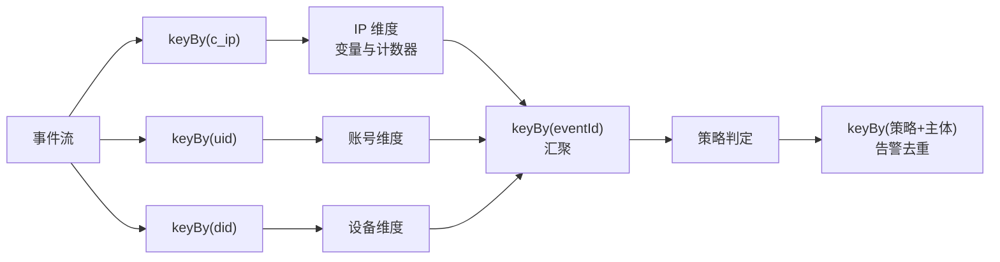

# engine —— 计算引擎

## 状态

| 层 | 状态 |
|---|---|
| **算子层**(聚合算子、HLL、事件元信息) | ✅ 已实现,与参考引擎共享测试向量 |
| **条件算子**(24 个,含类型严格与短路求值) | ✅ 已实现,共享向量 |
| **窗口层**(滑动 / 滚动 / 无界、迟到处理) | ✅ 已实现,共享向量 |
| **变量计算图**(依赖闭包、拓扑排序、六类节点、事件继承) | ✅ 已实现,跨语言快照对照 |
| **规则引擎**(条件树求值、内联计数器、CEL、告警去重与可解释性) | ✅ 已实现,端到端告警对照 |
| **Flink 接入**(单并行度,MiniCluster 中实跑验证) | ✅ |
| **多维度分区并行拓扑**(并行度 1/2/4 结果一致) | ✅ |
| **Checkpoint**(全部算子与窗口支持快照恢复,状态存于 ManagedState) | ✅ |
| CEP 序列模式检测 | 🚧 |

当前可编译、可测试,能加载仓库里真实的 170 条策略与 253 个变量,把事件流跑成风险告警,并已能作为 Flink 作业在 MiniCluster 中实际运行。

**能力边界**:Kafka 接入、ClickHouse 落库、Checkpoint、多维度并行拓扑都已实现(上表)。
仍不建议上生产的原因是别的:CEP 序列检测未实现;策略改动需重启作业才生效;
`NebulaJob` 固定单并行度,要并行需用 `NebulaParallelJob`(见下文「并行化」)。

## Flink 接入

`flink/` 包是 Flink 唯一出现的地方。算子、条件、窗口、变量图、规则五层都不依赖它 —— 因此可以脱离集群单元测试,也可以在离线回放等场景复用。该包只做「把 Flink 的生命周期与数据流接到引擎上」,不重复实现任何判定语义。

`FlinkJobTest` 在**进程内启动真实的 Flink 集群**(MiniCluster),提交作业,让事件真的流过算子,再把产出的告警与参考引擎的固化快照逐条比对。不是 mock,不是接口测试。

### 并行化

变量按不同维度分组(`c_ip` / `uid` / `did`),一次 `keyBy` 只能选一个 —— 按 IP 分区后,账号维度变量的状态就被拆到不同并行实例上,每个实例只看到部分数据,结果错误。

解法是**按维度拆链路,再按事件 ID 汇聚**:

三个设计要点:

**一、判定逻辑只有一份。** 单并行度与并行模式走的是同一个 `StrategyEngine`,差别只在值从哪来 —— 前者用 `LocalValueProvider` 现算,后者用 `PrecomputedValueProvider` 接收汇聚结果。这样不会出现「并行版和单机版结果不一致」这类最难排查的问题。

**二、等多少个维度由事件本身决定。** 一条匿名访问事件没有 `uid`,就不该等待账号维度的结果,否则永远等不齐。`DimensionPlan.expectedSignals` 只统计该事件**实际携带了值**的维度。1.x 用同样的思路解决这个问题(它叫「信号计数」),这是那套设计里少数值得原样继承的部分。

**三、去重必须独立成一个按主体分区的阶段。** 这一点是被测试抓出来的:去重的分组键是「策略 + 主体」,而汇聚阶段按事件 ID 分区。同一个 IP 的多条事件会落到不同的判定实例上,若在那里去重,每个实例各持一份状态、互相看不见,同一主体会被重复告警。

> **实证**:并行度 1 和 2 时这个缺陷恰好没暴露,并行度提到 4 才出现 —— 告警数从 13 变成 24。这正是「并行只应改变吞吐、不应改变结果」这条测试存在的意义。修复后重新注入缺陷(把去重的分区键改回事件时间),测试立刻再次失败。

`ParallelJobTest` 在并行度 1 / 2 / 4 下跑同一批事件,结果必须与参考引擎的固化快照完全一致。

### Checkpoint

全部算子与窗口都实现了 `snapshot()` / `restore()`,状态以普通数据形式导出;维度计算段、汇聚段、去重段的状态都存放在 Flink ManagedState 中。

**正确性的定义是「恢复后与从未中断完全一致」,而不是「能导出能导入」。** 后者太弱 —— 状态漏掉一个字段时,导出导入都不会报错,但恢复后的计算会悄悄偏离,这类问题在生产上极难定位。

`SnapshotRestoreTest` 因此对每个用例做四步:算一半 → 快照 → **真实 Java 序列化往返** → 用新实例恢复 → 喂完剩下的输入 → 与全程不中断的结果比对。序列化往返能顺带查出状态里混入了不可序列化对象。

负例验证:把 `MomentAccumulator` 的快照改成漏掉平方和,方差立刻从 4.571 变成 -2.857、标准差变成 NaN。

> **顺带发现的一处跨语言不一致**:`lastn` 在时间戳相同时,JS 返回最旧的 N 条、Java 返回最新的 N 条 —— 前者与「最近 N 条」的语义正好相反。此前从未暴露,因为共享向量里没有一条用例的时间戳相同。已修正 JS、补入向量与规格条款。
>
> 这也解释了为什么第一次注入 `lastn` 快照缺陷时测试没抓到:缺陷藏在一条没有测试覆盖的路径上。补完向量后再注入,立刻被抓到。

**性能取舍**:每处理一条事件都有一次状态的序列化往返。高吞吐场景可改为增量状态,但那需要先把滑动窗口从「保留原始事件」改成分桶聚合 —— 那会把过期粒度从精确到事件放宽到精确到桶,是可见的语义变化,要先改规格。当前选择精确语义。

## 与 1.x 的关系

1.x 的计算层是两套语义不一致的引擎:`greyhound`(Esper CEP,1 分钟粒度 5 分钟滑窗,精确去重)与 `bordercollie`(自研,1 小时滚动窗,HLL 近似)。同一个「去重计数」在两边算出不同的数。

2.0 合并为一套,理由与代价见 [ADR-0002](../../docs/adr/0002-flink-as-unified-engine.md)。
