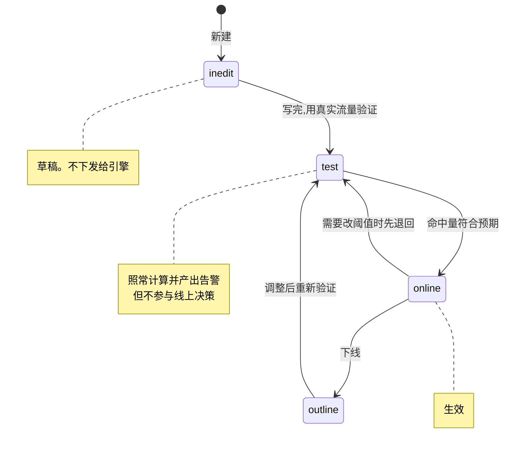

# 策略开发指南

怎么读懂内置策略、怎么改、怎么写新的。

---

## 1. 一条策略由什么构成

```json
{
  "name": "IP多次登录失败",
  "category": "ACCOUNT",
  "status": "test",
  "score": 0,
  "condition": { "conditions": [ ... ] },
  "action": { "check_type": "IP", "check_value": "c_ip",
              "decision": "review", "ttl": 300 }
}
```

| 字段 | 作用 |
|---|---|
| `condition` | 条件树,决定什么时候命中 |
| `action.check_type` | 风险主体的类型:`IP` / `USER` / `DeviceID` / `OrderID` |
| `action.check_value` | 从事件里取哪个字段作为主体值 |
| `action.decision` | 处置:`accept` / `review` / `reject` |
| `action.ttl` | 名单有效期(秒) |
| `status` | `inedit` 草稿 / `test` 计算但不参与决策 / `online` 生效 / `outline` 已下线 |

---

## 2. 条件的三种形式

条件树支持任意嵌套的 and / or / not,叶子节点有三种。

### 2.1 事件字段比较

```json
{"left": {"kind": "event_field", "field": "result"},
 "op": "==", "right": {"kind": "constant", "value": "F"}}
```

### 2.2 内联计数器(最常用)

```json
{"left": {"kind": "counter", "counter": {
    "algorithm": "count", "event": "ACCOUNT_LOGIN",
    "groupby": ["c_ip"], "window": 600,
    "filter": {"type": "simple", "object": "result", "operation": "==", "value": "F"}}},
 "op": ">", "right": {"kind": "constant", "value": "5"}}
```

读作:**这个 IP 在过去 600 秒内,`result` 为 `F` 的登录事件超过 5 次**。

`algorithm` 的取值与精确语义见[算子语义规格](../reference/operators.md) —— 那份文档是
规范性的,实现以它为准。

### 2.3 延迟判定:表达「缺席」

「主体做了 A,但随后 N 秒内**没有**做 B」—— 这类模式条件树表达不了:条件树只能对
当下这条事件求值,而「没有发生」要等一段时间之后才能确认。

```jsonc
{
  "condition": { ... },              // 主条件:做了 A
  "delay": {
    "duration_seconds": 300,         // 等 5 分钟
    "condition": {                   // 到期时求值:这 5 分钟里 B 出现过几次
      "left": { "kind": "counter", "counter": {
          "algorithm": "count", "event": "HTTP_DYNAMIC",
          "filter": { "object": "page", "operation": "==", "value": "/order/submit" },
          "groupby": ["c_ip"], "window": 300 } },
      "op": "==", "right": { "kind": "constant", "value": "0" }   // 一次都没有
    }
  }
}
```

主条件命中时挂起,到期时再求 `delay.condition` —— **那时窗口里已经积累了这段时间的
数据**,「B 出现过没有」才有答案。

典型用法:加入购物车但不下单、领券但不使用、注册后不激活。内置资产里有 3 条这样的
模板,`A` / `B` 是要你替换的占位符,见 [`seeds/PLACEHOLDERS.md`](../../seeds/PLACEHOLDERS.md)。

> **由事件时间驱动,不是挂钟时间。** 回放历史数据的结果必须与实时处理一致,否则同一批
> 事件在两种模式下会产出不同的告警。代价是:流里长时间没有新事件时,已到期的延迟不会
> 被触发 —— 这是事件时间语义的固有取舍。

### 2.4 多步序列(A → B → C)

「同一主体**依次**做了 A、B、C」。与上面的延迟判定相反:延迟判定关心的是某件事
**没有**发生,序列关心的是几件事**按顺序**发生了。

```jsonc
{
  // 序列策略没有 condition —— 判定跨多条事件,由 sequence 表达
  "sequence": {
    "steps": [
      { "event": "ACCOUNT_LOGIN" },
      { "event": "ACCOUNT_PASSWORD_CHANGE" },
      { "event": "ORDER_SUBMIT", "condition": {     // 步骤可以带附加条件
          "left": { "kind": "event_field", "field": "amount" },
          "op": ">", "right": { "kind": "constant", "value": "1000" } } }
    ],
    "within_seconds": 600,       // 三步要在 10 分钟内走完
    "by": ["uid"]                // 按账号分组
  }
}
```

典型用法:登录 → 改密 → 大额下单(账号被盗的常见轨迹)、注册 → 领券 → 立即下单。

几条要知道的语义:

- **每一步严格晚于前一步。** 同一毫秒的两条事件不构成先后。
- **一条事件只推进一个未完成匹配**,取进度最靠前的那个 —— 否则一条 B 会同时推进所有
  停在 A 的匹配,产出一堆重复告警。
- **构成一次匹配的事件不再参与后续匹配。**
- `by` 为空表示全局匹配,**那通常不是想要的** —— 不同主体的事件会被串成一条序列。
- 与延迟判定一样**由事件时间驱动**。

> **`max_partial_per_key`(默认 16)** 限制单个分组同时保留的未完成匹配数,超出时丢弃
> 最早的那个并计一次 `sequence_partial_dropped`。这是有状态检测的固有代价:每来一条
> 第一步事件都可能开启一次新匹配,不设上限时高频主体会把状态撑爆。**漏检是可观测的,
> 不是静默的。**

**分支(A 之后 B 或 C)不支持。** 需要时写成多条策略 —— 那样每条的命中量还能分别
看到,分支写法看不到。重复(A 出现 3 次以上)用内联计数器就能表达,不需要序列构造。

> **没有用 Flink CEP。** flink-cep 1.20.5 的模式在**构图时**编译进作业图,改一条序列
> 策略就得重启作业并丢掉全部窗口状态 —— 与[策略热更新](../development/roadmap.md)冲突。
> 而且参考引擎必须实现同样的语义供金标准向量对照,它不可能用 CEP,所以无论如何都要
> 手写一份。

### 2.5 CEL 表达式

用于时间窗口、地理位置等字段比较表达不了的判断。见
[CEL 表达式参考](cel-reference.md)。

---

## 3. 三维度镜像:为什么同一个风险要写三条

内置 170 条里,`IP` 83 条、`DeviceID` 45 条、`USER` 42 条。很多是同一个检测逻辑的三个
维度版本,比如「多次登录失败」IP 一条、设备一条、账号一条。

这**不是冗余**。攻击者能绕开其中任何一个维度:

- 换 IP(代理池)→ IP 维度失效,但设备指纹不变
- 换设备(模拟器)→ 设备维度失效,但目标账号集中
- 换账号(撞库)→ 账号维度失效,但源 IP 集中

三个维度同时绕开的成本高得多。爬虫场景里 6 条独立策略指向同一个 IP,就是这个设计的
直接体现 —— **单条策略容易被绕过,多角度交叉印证才有对抗价值**。

写新策略时值得问一句:这条规则从哪个维度看?攻击者换掉什么就能绕过?

---

## 4. 内置模板的三个已知局限

**这些模板不能直接上生产**,原因写在[策略模板参考](../reference/strategies.md)里:

| 局限 | 实际数据 |
|---|---|
| 处置动作全是转人工 | 170/170 是 `review`,没有一条会自动阻断 |
| 风险分未落地 | 169/170 的 `score` 为 0 |
| 阈值来自 1.x 当年某个站点 | 必须按你自己的流量重新校准 |

另有 **10 条策略含占位符**,不配置则不会正常工作,其中 3 条会产生大面积误报 —— 它们的
判定条件退化成恒真,会打中所有主体。这些在文档里用 🔧 标出,清单见
[`seeds/PLACEHOLDERS.md`](../../seeds/PLACEHOLDERS.md)。

全部以 `test` 状态分发:照常计算并产出告警,但不参与线上决策。

---

## 5. 阈值怎么校准

内置阈值(比如「10 分钟内失败 5 次」)对你的业务几乎肯定不对。

**用你自己的数据定,不要凭感觉调。**

1. 以 `test` 状态跑一段时间(建议至少覆盖一个完整业务周期,含周末与促销)
2. 查这条策略的实际命中量:

```bash
curl -u admin:<口令> -G localhost:8080/api/v2/alerts/trend \
  --data-urlencode 'from=2026-07-01T00:00:00Z' \
  --data-urlencode 'to=2026-07-26T00:00:00Z' \
  --data-urlencode 'strategy=IP多次登录失败' \
  --data-urlencode 'include_test=true'
```

3. 看 `subjects`(命中主体数)而不只是 `notices`(告警条数)—— 一个主体反复触发和一百个
   主体各触发一次,是完全不同的两件事
4. 抽查具体告警的 `variable_values`,确认判定依据符合预期
5. 调整后走 `PUT /api/v2/strategies/{name}`,写清 `change_note`

**命中量为 0 不代表阈值太高**,先按[接入指南 §6](integration.md) 倒推链路是否通了。

---

## 6. 生命周期



**不要从 `inedit` 直接跳到 `online`。** `test` 阶段的意义是用真实流量验证命中量,跳过
它等于拿线上业务做实验。

改策略走乐观并发:必须带上你读到的 `expected_version`,冲突返回 409 而不是静默覆盖。
每次改动会存一份完整快照进 `strategy_revisions`。

**回滚就是把某个旧版本重新提交一次**:

```bash
curl -u admin:<口令> localhost:8080/api/v2/strategies/{name}/revisions/3 > old.json
# 包装成 {"definition": <old.json>, "expected_version": <当前版本>, "change_note": "回滚到 v3"}
```

回滚本身也产生新版本,历史只增不改。

---

## 7. 校验会拦住什么

`PUT` 时分两层校验,一次返回全部问题。

**结构层**按 `strategy.schema.json` 校验 —— 字段缺失、类型不对、枚举值非法。

**引用层**检查 `counter.event` 指向的事件、`groupby` / `operand` / `filter.object` 用到的
字段是否真实存在。这层是 schema 管不了的:

```
counter 引用了不存在的事件:ORDER_SUBMITT(策略结构合法,但上线后永不命中,且不会报错)
```

`"event": "ORDER_SUBMITT"` 结构上完全合法,能保存、能上线,然后**永远不命中也永远不
报错** —— 运营看到的只是「这条策略没量」,查不出原因。这类静默失效比直接报错危险得多。

注意子事件继承父事件的字段:`ACCOUNT_LOGIN` 上可以用 `c_ip`,因为它来自 `HTTP_DYNAMIC`。

---

## 8. 常见误区

**把 `contains` 当正则用。** 1.x 有 6 条策略犯了这个错,导致永不命中。这些缺陷保留在
内置资产里并加了回归测试,见 [`seeds/INVENTORY.md`](../../seeds/INVENTORY.md)。

**以为 `score` 会影响判定。** 它目前只是一个记录值,不参与决策。

**忽略 `check_value`。** `check_type` 是 `IP` 但 `check_value` 写成 `uid`,名单会以账号为
键写进去,而业务系统按 IP 查 —— 查不到,且不报错。

**用未配置的占位符策略。** 它们的条件退化成恒真,会打中所有主体,包括全部正常用户。

**在 `online` 状态下调阈值。** 先切回 `test` 观察,或者新建一条并行跑。

---

## 相关文档

| | |
|---|---|
| [策略模板参考](../reference/strategies.md) | 170 条逐条说明 |
| [算子语义规格](../reference/operators.md) | 算子的精确定义(规范性) |
| [变量全表](../reference/variables.md) | 253 个变量 |
| [风控数据模型](../concepts/data-model.md) | 四层模型 |
| [API 参考](../reference/api.md) | 策略读写接口 |
