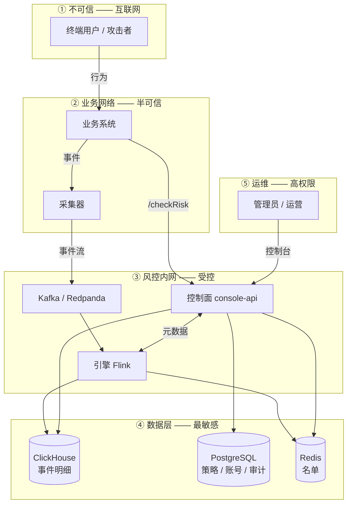

# 威胁模型

本文描述星云 2.0 的信任边界、攻击面与已实施的缓解措施,并**明确列出没有做的部分**。

写它的目的不是证明系统安全,而是让部署方知道自己接手了什么:哪些事系统替你挡了,哪些
事系统假设你会挡。一份只列优点的威胁模型没有用 —— 真正会出事的地方恰恰在「以为对方
做了」的那些缝隙里。

> 适用范围:2.0(本仓库)。1.x 已停止维护,其安全状况见 [SECURITY.md](../../SECURITY.md)。

---

## 一、这个系统特殊在哪

风控系统与普通业务系统有一处根本区别:**它的对手会读它的输出,并据此调整行为。**

普通系统的攻击者想拿到数据或权限;风控系统的攻击者往往只想知道「我做到什么程度会被
拦」。这带来一类别处没有的威胁 —— 策略探测、告警淹没、名单投毒 —— 它们不违反任何
访问控制,却能让整套风控失效。这些单列在[第五节](#五风控特有的威胁)。

另一处区别:**这个系统本身就是一个个人信息集中地。** 它按设计收集账号、设备、IP、
行为轨迹,而且为了做关联分析必须把它们放在一起。拖库的后果比多数业务系统更严重,
所以存储层的处理见[隐私设计](privacy.md)。

---

## 二、信任边界

| 边界 | 谁跨越 | 跨越时发生什么 |
|---|---|---|
| ① → ② | 终端用户 | 业务系统自己的鉴权。**风控不参与** |
| ② → ③ | 业务系统调 `/checkRisk` | 服务令牌 **∧** 来源网段,两者都要满足 |
| ② → ③ | 采集器写事件(HTTP) | 共享令牌(`NEBULA_COLLECTOR_TOKEN`),定长比较 |
| ② → ③ | 采集器写事件(syslog) | **无认证** —— 协议本身没有认证的位置,见[第四节](#四已知未缓解) |
| ③ → ④ | 引擎与控制面读写存储 | 独立账号口令,由 `.env` 注入 |
| ⑤ → ③ | 人登录控制台 | HTTP Basic + Argon2id + 失败锁定 |

**最关键的一条:人类账号与服务令牌不通用。** 人类账号调不了 `/checkRisk`,服务令牌
调不了管理接口。这两条在授权矩阵测试里各有一个用例钉着 —— 授权规则是那种改一行就
静默放宽的东西,给 `/api/v2/**` 加一条 `permitAll` 不会有任何报错。

---

## 三、攻击面与已实施的缓解

### 3.1 控制台与管理 API

| 威胁 | 缓解 |
|---|---|
| 口令爆破(在线) | 按「来源 IP + 账号」组合计数,达上限锁定;锁定期内**即便口令正确也拒绝** —— 否则「是否立刻返回成功」会告诉攻击者哪次猜中了 |
| 口令爆破(离线,库已泄露) | Argon2id,不是 bcrypt 也不是 SHA |
| 越权 | 三种角色 + 逐路径的授权矩阵;`anyRequest().denyAll()` 兜底,新增接口默认拒绝而不是默认放行 |
| SQL 注入 | ClickHouse 走 `{name:Type}` 占位符,客户端**不提供**任何拼 SQL 的入口;PostgreSQL 走 JdbcTemplate 参数绑定 |
| 令牌泄露后长期有效 | 令牌可吊销;`last_used_at` 让「还有谁在用」可查 |
| 口令 / 令牌明文外泄 | 服务端只存哈希,明文只在签发响应中出现一次;界面不写 localStorage / cookie / URL |
| 审计被篡改以掩盖操作 | 控制面**不提供**任何删除或修改审计记录的接口(部分缓解,见下) |

审计那条要说清楚:**API 层面没有删除入口,但拿到数据库账号的人可以直接改表。** 真正
的防篡改需要把审计投递到系统之外(SIEM、只追加存储),那属于部署方的事,系统没有替你做。

### 3.2 `/checkRisk` 接入

| 威胁 | 缓解 |
|---|---|
| 令牌被盗后从任意位置调用 | 令牌 **∧** 网段。1.x 是「或」,任一满足即放行 —— 那等于网段限制不存在 |
| 时序侧信道推测令牌 | 定长比较,不按字节短路 |
| 令牌 ID 枚举 | 校验失败一律 401,不区分「令牌不存在」与「密钥不对」 |

### 3.3 数据层

| 威胁 | 缓解 |
|---|---|
| 拖库拿到账号 / 设备 ID | `pii` 列以 HMAC 存储,密钥不在数据库里 |
| 拖库拿到证件号、手机号等 | `sensitive` 字段**在采集端**就被脱敏,根本不进链路 |
| 过期数据长期留存 | 存储层 TTL,不依赖运维脚本 |
| 主体行使删除权 | [主体权利接口](privacy.md#四数据主体权利) |

HMAC 那条不等于「拖库什么都拿不到」:`c_ip`、页面路径、时间序列仍是明文,攻击者
能重建行为轨迹,在很多情况下足以定位到人。它降低的是**直接拿到标识符**的风险,
不是消除关联风险。

### 3.4 组件间通信

Kafka 用 `PLAINTEXT`,ClickHouse / PostgreSQL / Redis 用口令但**不加密传输**。这是
刻意的:私有化部署里这些组件通常在同一个受控网段内,强制 TLS 会带来证书轮换的运维
负担,而多数部署方并不会真的去做,最后变成「配了但没验证」。

**代价是:一旦攻击者进入该网段,组件间流量是明文的。** 如果你的部署不满足「同一受控
网段」这个前提,必须自行启用 TLS —— 这些组件都支持,是配置问题而不是改造问题。

---

## 四、已知未缓解

这一节列的是**系统确实没做**的事。写在这里而不是藏起来,是因为部署方需要据此决定
补什么。

| 缺口 | 后果 | 谁来补 |
|---|---|---|
| **syslog 入口无认证**(协议本身没有认证的位置) | 能向该端口发包的人都能伪造事件 | 部署方:绑定内网地址 + 网络策略限制来源。采集器启动时会打印提示 |
| **共享令牌不区分客户端** | 令牌泄露后无法只吊销一个调用方 | 部署方:需要按客户端区分身份与吊销时,在前面放反向代理做 mTLS |
| **控制面不做 TLS 终结** | 明文传输 Basic 凭据 | 部署方:前置反向代理。**不要**把 8080 直接暴露 |
| **管理接口无全局限流** | 认证后的接口可被高频调用拖垮 | 部署方:代理层限流 |
| **compose 把数据库端口映射到宿主机** | `5432` / `8123` / `6379` / `9092` 对宿主机可达 | 那份 compose 是**开发用**的;生产部署必须去掉这些映射 |
| **无 SBOM、无依赖漏洞扫描** | 依赖出 CVE 时不会主动发现 | 见 [SECURITY.md](../../SECURITY.md) 的规划 |
| **无多租户隔离** | 一套部署内所有人看到同一份数据 | 明确不打算做,见[路线图](../development/roadmap.md) |

关于 compose 那条要强调:`deploy/compose/` 的目的是**十分钟内跑起来看看**,不是生产
模板。它把端口映射出来是为了让人能用本机工具连上去排查。照抄到生产环境等于把四个
数据库直接摆到网络上。

---

## 五、风控特有的威胁

这一节是这份文档存在的主要理由。上面那些威胁在任何系统里都有,下面这些只在风控系统里有。

### 5.1 策略探测

**攻击者用低成本的试探请求,反推出策略的阈值与维度,然后精确地停在阈值之下。**

一个典型过程:每分钟登录 4 次不被拦,5 次被拦 —— 攻击者就知道了窗口与阈值,此后
永远每分钟 4 次。这不需要任何越权,只需要观察系统对自己的反应。

系统做了什么:

- `/checkRisk` 的响应**不包含**触发的变量值、窗口长度、阈值,也不包含风险分 ——
  攻击者拿不到「我现在是 4,阈值是 5」这种可以直接照着调的数字。

系统没有做的、也**做不到**的:

- **响应会列出全部命中,每条带 `rule_name`(策略名)与 `remark`(备注)。** 这是
  1.x 传下来的接口契约,业务侧用它做差异化处置(比如「设备风险」提示换设备,
  「账号风险」提示改密码)。它同时也告诉攻击者自己撞上了哪些规则 —— 而且是全部,
  不只是最终生效的那条。

  **部署方必须做的两件事:**
  1. 不要把 `rule_name` / `remark` 透传给终端用户。它们是给业务系统内部用的,很多
     绕过案例的起点就是前端把风控原因原样弹了出来。
  2. 策略的 `remark` 里不要写阈值与逻辑。它会随每次命中一起返回。

- 更根本地,**只要系统对不同行为有不同反应,探测就永远可能**。能做的是提高探测成本
  (阈值随机抖动、灰度放行),不是消除。当前版本没有实现这类机制。

### 5.2 告警淹没

**攻击者制造大量低价值告警,让运营看不见其中真正的那条。**

系统做了什么:

- 策略有测试态:照常计算、照常产出告警供校准,但**不参与 `/checkRisk` 的线上决策**。
  新策略可以先跑一段时间看误报率,再切到 `online`。

  > 写这份文档时去核实这条,发现它当时**并不成立** —— `/checkRisk` 从未过滤测试态
  > 名单,而内置模板 170 条全部以测试态分发。已修复(见 CHANGELOG)。这类「文档写了、
  > 实现没有」的缺口正是威胁模型该找出来的东西。

- 告警查询支持按场景、策略、决策、时间过滤,不是一条流水线看到底。

系统没做的:告警的自动聚合与降噪、告警量异常时的元告警。**运营侧的注意力是有限资源,
而当前版本没有保护这个资源的机制。**

### 5.3 名单投毒

**攻击者故意让别人的标识落进黑名单**,造成拒绝服务。

最常见的形态:攻击者用受害者的账号名反复触发风控,直到该账号被拉黑;或者伪造事件,
把某个 IP 段刷进名单 —— 而那个 IP 段是某个企业客户的出口。

系统做了什么:

- 名单有 TTL,不是永久 —— 投毒的效果会自行过期。
- 名单可通过[主体权利接口](privacy.md#四数据主体权利)清除。

- **采集器的 HTTP 入口有共享令牌校验**了。未配置令牌时不启用,但**启动会打印警告** ——
  「忘了配」与「明确决定不配」在日志里能区分开。

系统仍没做的:

- **syslog 入口没有认证。** syslog 协议本身没有放认证的位置,能向该端口发包的人就能
  伪造事件。只能靠绑定内网地址与网络策略,采集器启动时会打印提示。
- 没有「同一主体被拉黑的速率」这类元监控 —— 投毒正在发生时,系统不会主动告诉你。

### 5.4 策略本身就是资产

策略定义(阈值、维度、组合逻辑)是风控团队的核心积累,拿到它等于拿到完整的绕过手册。

系统做了什么:策略读接口需要认证;VIEWER 能读、OPERATOR 能改、只有 ADMIN 能签发令牌
与管理账号;每次策略变更都有修订历史与审计。

系统没做的:**策略对所有已认证角色可读。** 没有「策略级别的可见性控制」—— 一个只读
账号能看到全部策略定义。如果你的组织里「能看告警」和「能看策略」应该是两拨人,当前
版本满足不了。

---

## 六、部署方检查清单

按重要性排序。前四条不做,前面所有缓解措施的意义都会打折。

- [ ] **不要把控制面 8080 直接暴露。** 前置反向代理,终结 TLS。
- [ ] **给采集器的 HTTP 入口配 `NEBULA_COLLECTOR_TOKEN`**,并确认启动日志里没有那条
      「未设置」警告。
- [ ] **采集器只监听内网地址** —— syslog 入口没有认证可配,这是它唯一的防线。
- [ ] **生产部署不要照抄 `deploy/compose/`**,尤其要去掉数据库的端口映射。
- [ ] **不要把 `/checkRisk` 响应里的 `rule_name` 透传给终端用户。**
- [ ] 首次启动打印的管理员口令,登录后立即更换。
- [ ] `.env` 里的每个口令都独立生成,不复用;文件权限 `600`。
- [ ] `NEBULA_HMAC_KEY` 与数据库凭据**分开保管** —— 放在一起时 HMAC 就没有意义了。
- [ ] 决定是否轮换 HMAC 密钥**之前**读[隐私文档](privacy.md):轮换后无法再按主体删除轮换前的数据。
- [ ] 审计日志投递到系统之外的只追加存储。
- [ ] 组件不在同一受控网段时,为 Kafka / ClickHouse / PostgreSQL / Redis 启用 TLS。
- [ ] 定期检查服务令牌的 `last_used_at`,清理不再使用的。

---

## 七、报告安全问题

请勿通过公开 issue 报告。流程见 [SECURITY.md](../../SECURITY.md)。

---

## 相关文档

| | |
|---|---|
| [安全策略](../../SECURITY.md) | 支持范围、漏洞报告流程、已实施与规划中的措施 |
| [隐私设计与合规](privacy.md) | 数据分级、脱敏、保留期、主体权利 |
| [API 参考](../reference/api.md) | 接口与权限矩阵 |
